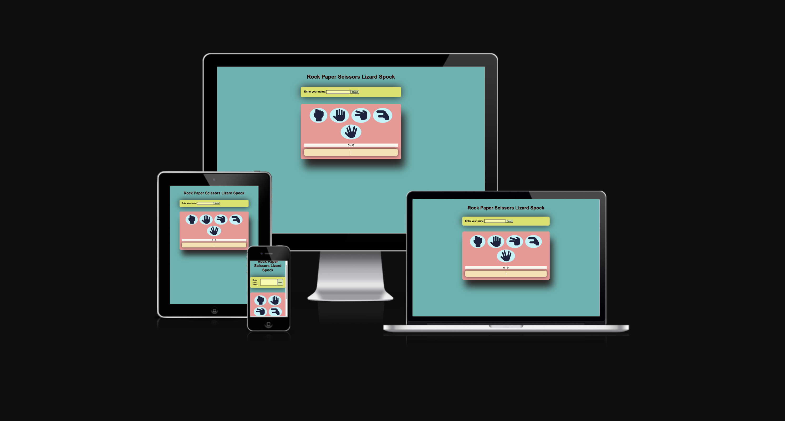
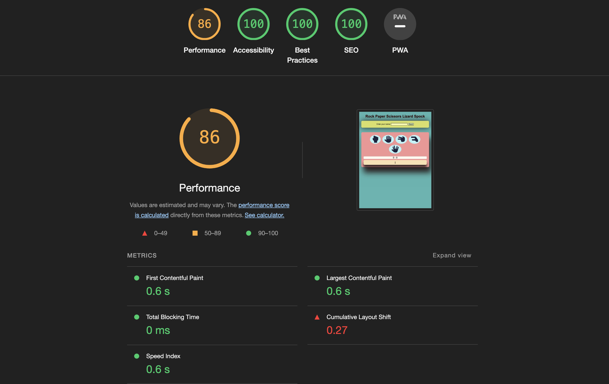
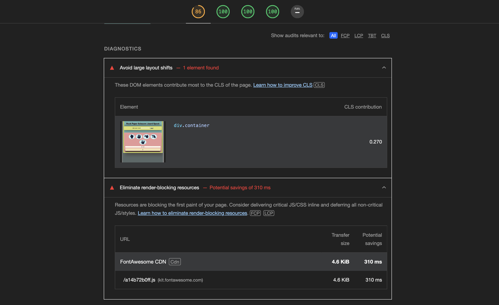
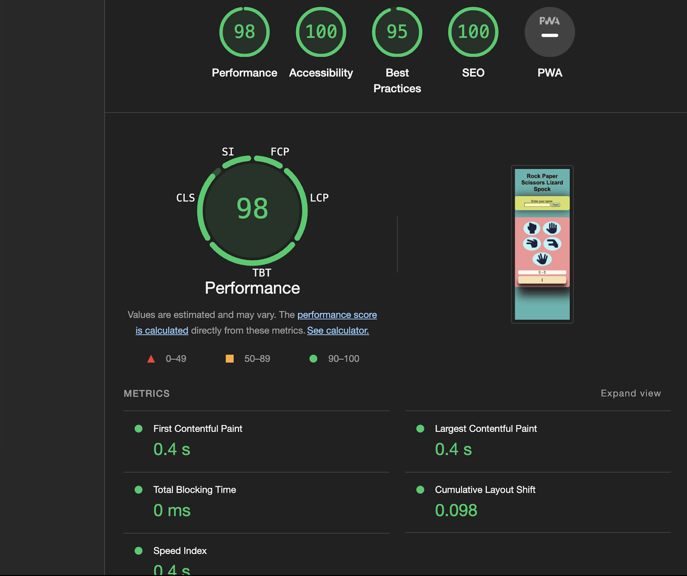
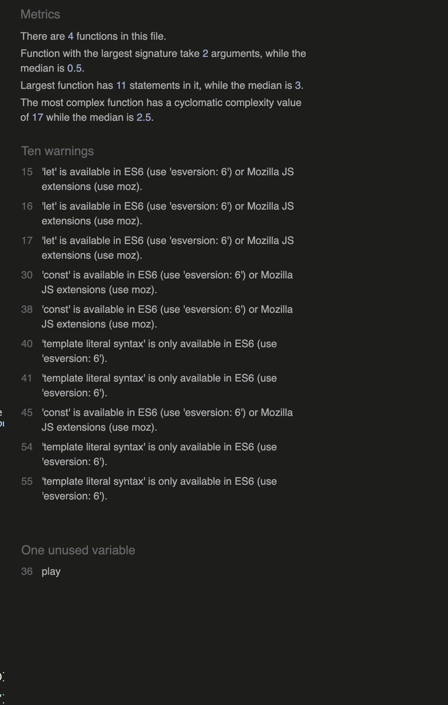

# Rock Paper Scissors Lizard Spock
Rock Paper Scissors Lizard Spock is a game ...

-- what it aims to acomplish

-- who is the target audience 

-- how it will benefit the target audience

## Features 

### Existing Features

- __Header__

- __The Player Input__

+ Player Name
+ Reset Button

  

- __The Game Area__

+ Possible Choices
+ Results
+ Score
+ The Choices  made by Player and Computer

 

### Features Left to Implement

I want to add a timer to allow users to play against the clock. Timer with the ability to select the time length in seconds and minutes. Such a feature would allow the players to decide the length of the session. For instance, adapting the decision to the user's own needs (time constraints).
The game will become more attractive and the participants motivation will increase as they want to win before the allotted time expires.

## Testing 

### Validator Testing 

- HTML
    - No errors were returned when passing through the official [W3C validator](https://validator.w3.org/nu/?doc=https%3A%2F%2Fannam-salamon.github.io%2Frock-paper-scissors-lizard-spock%2F) 
- CSS
    - No errors were found when passing through the official [(Jigsaw) validator](https://jigsaw.w3.org/css-validator/)
- JavaScriopt
    - No errors were found when passing through the official [Jshint validator](https://jshint.com/)

    
      
### Unfixed bugs

No unfixed bugs

## Deployment

This section should describe the process you went through to deploy the project to a hosting platform (e.g. GitHub) 

- The site was deployed to GitHub pages. The steps to deploy are as follows: 
  - In the GitHub repository, navigate to the Settings tab 
  - From the source section drop-down menu, select the Master Branch
  - Once the master branch has been selected, the page will be automatically refreshed with a detailed ribbon display to indicate the successful deployment. 

The live link can be found here - 
https://annam-salamon.github.io/rock-paper-scissors-lizard-spock/

## Credits 

### Content 

-  Ideas on how to start project from You Tube  https://www.youtube.com/watch?v=ec8vSKJuZTk
-  Tutorials  on JavaScript topics, CSS flex box, CSS box shadow property,  from https://developer.mozilla.org/en-US/, https://www.w3schools.com/, https://www.udemy.com/course/the-web-developer-bootcamp/

- Instructions how to improve Lighthouse  Performance score from https://blog.logrocket.com/9-tricks-eliminate-render-blocking-resources/#minifiy-css-javascript, https://blog.logrocket.com/9-tricks-eliminate-render-blocking-resources/#minifiy-css-javascript

-  The icons in The Game are are taken from [Font Awesome](https://fontawesome.com/)
-  Colours contrast to improve SEO https://colourcontrast.cc/, 

### Media

No use of photos or images in the project only screenshosts from the Rock Paper Scissors Lizard Spock Game.

